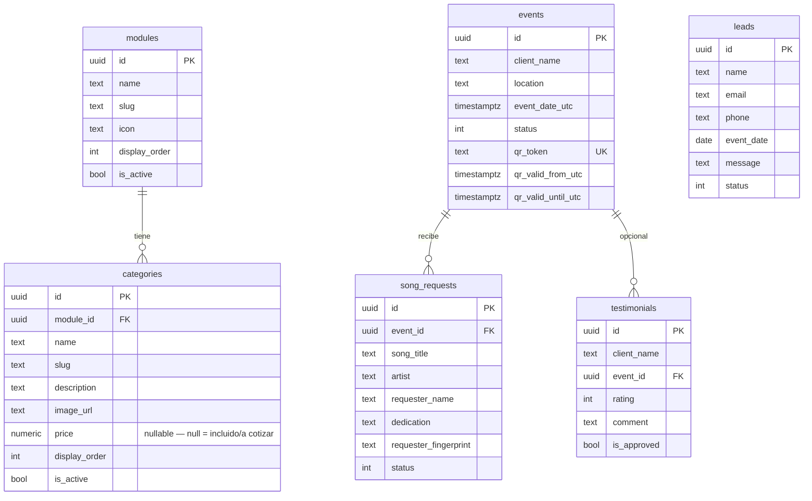

# Base de datos

PostgreSQL. Sin ORM de por medio — el esquema vive en SQL plano en `backend/src/DjMrkos.Migrator/Scripts/`, aplicado por **DbUp** (no hay migraciones de EF Core; ver [ARCHITECTURE.md](ARCHITECTURE.md#por-qué-dapper-y-no-ef-core)).

## Tablas



Columnas en `snake_case` — Dapper las mapea a las propiedades `PascalCase` de C# gracias a una sola línea en el arranque: `Dapper.DefaultTypeMap.MatchNamesWithUnderscores = true` (`Infrastructure/DependencyInjection.cs`).

## Decisiones de modelado

- **`categories.module_id` es `NOT NULL`** — una categoría siempre pertenece a exactamente un módulo. Esa es la única regla de jerarquía que sostiene todo el menú configurable; no existe un tercer nivel en la base (un "ítem" dentro de una categoría queda documentado como extensión futura en el modelo de Application, no implementado en v1).
- **Soft delete en `modules` y `categories`** (`is_active = false`, sin `DELETE`) — un módulo desactivado puede tener categorías que a su vez referencian solicitudes de canciones históricas indirectamente vía el catálogo mostrado en su momento. Borrar la fila rompería esa trazabilidad sin ganar nada.
- **`events.qr_token` es único** y las columnas `qr_valid_from_utc` / `qr_valid_until_utc` viven en la fila del evento, no calculadas al vuelo desde `event_date_utc` en cada consulta — así el negocio puede, en el futuro, ajustar la ventana de un evento puntual sin tocar código.
- **`song_requests.requester_fingerprint`** no es un dato personal — es un hash SHA-256 de IP + User-Agent, usado únicamente por el limitador de tasa (`ix_song_requests_rate_limit`). No hay forma de revertirlo a una identidad.
- **`categories.price`** es nullable a propósito: `NULL` significa "va incluido al contratar el módulo, no es un artículo independiente" (p. ej. los géneros musicales del DJ), mientras que un valor es el precio "desde" que el cotizador del frontend usa para armar el presupuesto — ver [FRONTEND.md](FRONTEND.md#cotizador-tipo-carrito).
- **Índices** pensados para las dos consultas calientes: el menú público (`ix_modules_active_order`, `ix_categories_module_active_order`) y la cola en vivo de un evento (`ix_song_requests_event`).

## Nota de compatibilidad con Dapper

Los repositorios mapean cada fila a un `record` con **solo propiedades `init`** (sin constructor posicional). Esto no es estilo — un `record` con constructor posicional fuerza a Dapper a mapear por posición de parámetro, que espera un nombre literal como `display_order`, y `DefaultTypeMap.MatchNamesWithUnderscores` nunca entra en juego para ese camino. Con propiedades `init`, Dapper mapea por *setter* y sí resuelve `display_order` → `DisplayOrder`. Si agregas un repositorio nuevo, sigue el mismo patrón (ver cualquier `*Row` en `Infrastructure/Repositories/`).

## Aplicar el esquema

```bash
dotnet run --project backend/src/DjMrkos.Migrator -- "Host=localhost;Port=5432;Database=djmrkos;Username=djmrkos;Password=djmrkos_dev"
```

`0001_InitialSchema.sql` crea las tablas; `0002_SeedMenu.sql` siembra el catálogo de ejemplo (Luces, Música, Cabina, Sonido) para que el portal tenga contenido real desde el primer arranque. Agregar un cambio de esquema es agregar un archivo `000N_Descripcion.sql` nuevo en `Scripts/` — DbUp lleva su propio registro de qué scripts ya corrieron y nunca reaplica uno.
